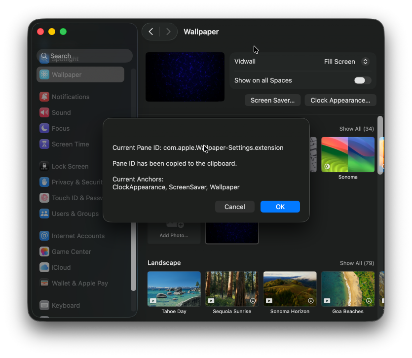
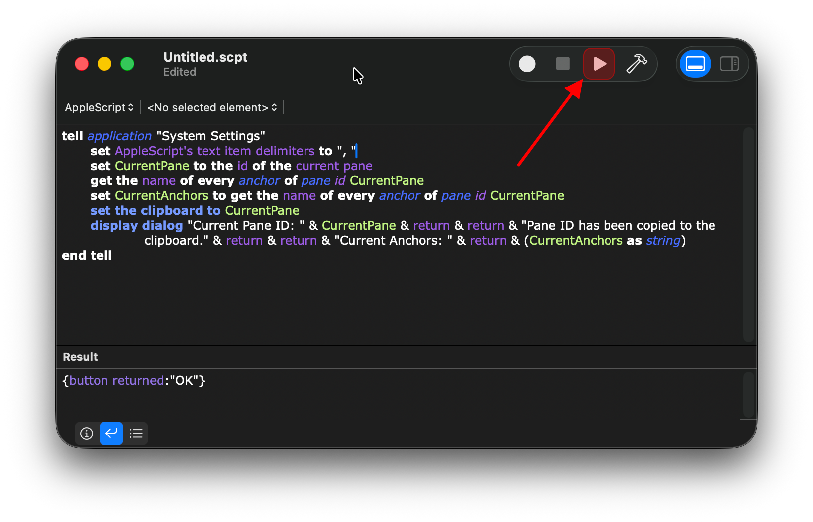
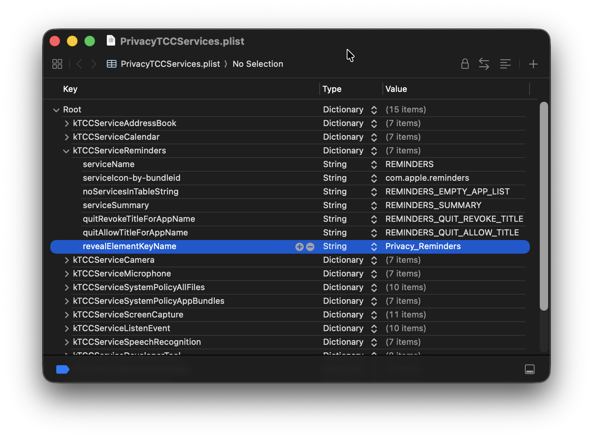

<div markdown="1">
  <sup>Using <a href="https://wangchujiang.com/#/app" target="_blank">my app</a> is also a way to <a href="https://wangchujiang.com/#/sponsor" target="_blank">support</a> me:</sup>
  <br>
  <a target="_blank" href="https://github.com/jaywcjlove/vidwall-hub" title="Vidwall Hub for macOS"></a>
  <a target="_blank" href="https://apps.apple.com/app/VidCrop/6752624705" title="VidCrop for macOS"></a>
  <a target="_blank" href="https://apps.apple.com/app/Vidwall/6747587746" title="Vidwall for macOS"></a>
  <a target="_blank" href="https://wangchujiang.com/mousio-hint/" title="Mousio Hint for macOS"></a>
  <a target="_blank" href="https://apps.apple.com/app/6746747327" title="Mousio for macOS"></a>
  <a target="_blank" href="https://apps.apple.com/app/6745227444" title="Musicer for macOS"></a>
  <a target="_blank" href="https://apps.apple.com/app/6743841447" title="Audioer for macOS"></a>
  <a target="_blank" href="https://apps.apple.com/app/6744690194" title="FileSentinel for macOS"></a>
  <a target="_blank" href="https://apps.apple.com/app/6743495172" title="FocusCursor for macOS"></a>
  <a target="_blank" href="https://apps.apple.com/app/6742680573" title="Videoer for macOS"></a>
  <a target="_blank" href="https://apps.apple.com/app/6740425504" title="KeyClicker for macOS"></a>
  <a target="_blank" href="https://apps.apple.com/app/6739052447" title="DayBar for macOS"></a>
  <a target="_blank" href="https://apps.apple.com/app/6739444407" title="Iconed for macOS"></a>
  <a target="_blank" href="https://apps.apple.com/app/6737160756" title="Mousio for macOS"></a>
  <a target="_blank" href="https://apps.apple.com/app/6723903021" title="Paste Quick for macOS"></a>
  <a target="_blank" href="https://apps.apple.com/app/6670696072" title="Quick RSS for macOS/iOS"></a>
  <a target="_blank" href="https://apps.apple.com/app/6670167443" title="Web Serve for macOS"></a>
  <a target="_blank" href="https://apps.apple.com/app/6503953628" title="Copybook Generator for macOS/iOS"></a>
  <a target="_blank" href="https://apps.apple.com/app/6471227008" title="DevTutor for macOS/iOS"></a>
  <a target="_blank" href="https://apps.apple.com/app/6479819388" title="RegexMate for macOS/iOS"></a>
  <a target="_blank" href="https://apps.apple.com/app/6479194014" title="Time Passage for macOS/iOS"></a>
  <a target="_blank" href="https://apps.apple.com/app/6478772538" title="IconizeFolder for macOS"></a>
  <a target="_blank" href="https://apps.apple.com/app/6478511402" title="Textsound Saver for macOS/iOS"></a>
  <a target="_blank" href="https://apps.apple.com/app/6476924627" title="Create Custom Symbols for macOS"></a>
  <a target="_blank" href="https://apps.apple.com/app/6476452351" title="DevHub for macOS"></a>
  <a target="_blank" href="https://apps.apple.com/app/6476400184" title="Resume Revise for macOS"></a>
  <a target="_blank" href="https://apps.apple.com/app/6472593276" title="Palette Genius for macOS"></a>
  <a target="_blank" href="https://apps.apple.com/app/6470879005" title="Symbol Scribe for macOS"></a>
</div>
<hr>

SystemSettings for MacOS
===

In macOS, the URL Schemes for commonly used System Settings panes are stored in the `Sidebar.plist` file, which can be found at the following path:

```
/System/Applications/System Settings.app/Contents/Resources/Sidebar.plist
```

In Swift, you can open the corresponding System Settings pane directly by simply adding the `x-apple.systempreferences:` prefix.

```swift
NSWorkspace.shared.open(
    URL(string: "x-apple.systempreferences:com.apple.Wallpaper-Settings.extension")!
)
```

You can also open it using the open command:

```shell
$ open x-apple.systempreferences:com.apple.Passwords
$ open "x-apple.systempreferences:com.apple.settings.PrivacySecurity.extension?Privacy_Advertising"
```

In System Settings, besides the sidebar items, there are some interfaces that also support URL Schemes, but they are not in that plist file. To get these items, you can use the `strings` command to extract strings from the System Settings app that may belong to deeper submenus.

## System Settings

```shell
for pref in $( \
  strings "/System/Applications/System Settings.app/Contents/MacOS/System Settings" | \
  awk '/^com.apple./ {print $1 }' \
); do echo "$pref"; done
```

Here is the output of the command above:

```
com.apple.systempreferences.debug
com.apple.ClassroomSettings
com.apple.CD-DVD-Settings.extension
com.apple.preferences.ClassKitPreferencePane
com.apple.Passwords
com.apple.LoginItems-Settings.extension
com.apple.Passwords-Settings.extension
com.apple.Transfer-Reset-Settings.extension
com.apple.Date-Time-Settings.extension
com.apple.SystemProfiler.AboutExtension
com.apple.Startup-Disk-Settings.extension
com.apple.Software-Update-Settings.extension
com.apple.Localization-Settings.extension
com.apple.Coverage-Settings.extension
com.apple.Sharing-Settings.extension
com.apple.AirDrop-Handoff-Settings.extension
com.apple.settings.Storage
com.apple.Time-Machine-Settings.extension
com.apple.ExtensionsPreferences
com.apple.Profiles-Settings.extension
com.apple.systempreferences.GeneralSettings
com.apple.settings.PrivacySecurity.extension
com.apple.Battery-Settings.extension
com.apple.Touch-ID-Settings.extension
com.apple.systempreferences.AppleIDSettings
com.apple.FollowUpSettings.FollowUpSettingsExtension
com.apple.Family-Settings.extension
com.apple.Displays-Settings.extension
com.apple.BluetoothSettings
com.apple.Desktop-Settings.extension
com.apple.Accessibility-Settings.extension
com.apple.preference.desktopscreeneffect
com.apple.Wallpaper-Settings.extension
com.apple.preference.network
com.apple.Network-Settings.extension
com.apple.preferences.configurationprofiles
com.apple.package
com.apple.bundle
com.apple.systempreference.prefpane
com.apple.Classroom-Settings.extension
com.apple.ScreenSaver-Settings.extension
com.apple.systemsettings.usercache
com.apple.systempreferences.cache
com.apple.HeadphoneSettings
com.apple.systempreference.toggleTouchBarControlStripCustomizationPalette
com.apple.FollowUpSettings
com.apple.Touch-ID-Settings
com.apple.systempreferences
com.apple.Family-Settings.extension*Family
com.apple.Network-Link-Conditioner
com.apple.Appearance-Settings.extension
com.apple.preference
com.apple.systemsettings.legacyPane
com.apple.systemsettings.extensions
com.apple.Users-Groups-Settings.extension
com.apple.systemsettings.extensions.didchange
com.apple.settings
com_apple_system_prefs_keywords
com_apple_system_prefs_keywords
com.apple.systempreferences.InstallHelper
com.apple.systempreferences.read-only
com.apple.systempreferences.refreshdocktile
com.apple.systemsettings.menucache
com.apple.SystemSettings.CoreAnalytics.searchAbandonment
com.apple.SystemSettings.CoreAnalytics.struggle
com.apple.SystemSettings.CoreAnalytics.navigation
com.apple.SystemSettings.CoreAnalytics.windowResize
```

## Calendar

```shell
for pref in $( \
  strings "/System/Applications/Calendar.app/Contents/MacOS/Calendar" | \
  awk '/^com.apple./ {print $1 }' \
); do echo "$pref"; done
```

Here is the output of the command above:

```shell
com.apple.calendar
com.apple.CalendarFileHandler
com.apple.Calendar
com.apple.iCal
com.apple.reminders
com.apple.calendar.viewAtLaunch
com.apple.calendar.viewTransitions
com.apple.calendar.TimeZoneChanged
com.apple.calendar.LocaleChanged
com.apple.calendar.mergeCalendarQueue
com.apple.calendar.continuity.event_selection
com.apple.calendar.continuity.date_selection
com.apple.calendar.ics
com.apple.ical.ics
com.apple.ical.readonly
com.apple.ical.group
com.apple.ical.invitation
com.apple.ical.nopermission
com.apple.ical.birthdays
com.apple.ical.itip
com.apple.ical.caldav.readonly.private
com.apple.ical.reminders
com.apple.ical.itip.receive.request
com.apple.ical.itip.receive.reply
com.apple.ical.itip.send
com.apple.ical.mailcalendar
com.apple.ical.noevents
com.apple.AddressBook
com.apple.Reminders
com.apple.calendar.restoreQueue
com.apple.mail
com.apple.iCal.automaticInvitationChange
com.apple.calendar.pasteboard.ekcalendar
com.apple.calendar.pasteboard.eksource
com.apple.iCal.pasteboard.dragOriginDate
com.apple.calendar.weatherCache
com.apple.Siri
com.apple.calendar.navigation.mode
com.apple.calendar.monthViewEvents
com.apple.%@
com.apple.suggestions
com.apple.suggestions.settingsChanged
com.apple.eventkit.CalendarDiagnosticExtension
com.apple.CalendarDiagnostics.CalendarDiagnosticExtensionUnredacted
com.apple.calendar.cal
```

## Reminders

```shell
for pref in $( \
  strings "/System/Applications/Reminders.app/Contents/MacOS/Reminders" | \
  awk '/^com.apple./ {print $1 }' \
); do echo "$pref"; done
```

Here is the output of the command above:

```shell
com.apple.calendar.LocaleChanged
com.apple.reminders.deviceListDevicesMutex
com.apple.reminders
com.apple.remindd.userAction
com.apple.reminders.createCSL
com.apple.reminders.boardView.column
com.apple.reminders.help
com.apple.reminders.sharingextension
```

## Finding Pane IDs and Anchors

You can use the following `AppleScript` to find the pane and its associated deeplink anchors: Paste the code into `Script Editor.app`, open `System Preferences` and navigate to the pane you want to identify, then run the script. It will output the name of the current pane and any associated anchors.

```applescript
tell application "System Settings"
	set AppleScript's text item delimiters to ", "
	set CurrentPane to the id of the current pane
	get the name of every anchor of pane id CurrentPane
	set CurrentAnchors to get the name of every anchor of pane id CurrentPane
	set the clipboard to CurrentPane
	display dialog "Current Pane ID: " & CurrentPane & return & return & "Pane ID has been copied to the clipboard." & return & return & "Current Anchors: " & return & (CurrentAnchors as string)
end tell
```





This script does not capture all the anchors that can be deep-linked to. If some anchors are missing, you may need to dig into the preference pane itself to see if there are any code snippets referencing other available options that we cannot identify as anchors. For example, when the script is run against the "Security & Privacy" pane, it doesn't return any options for the "Input Monitoring" section. However, you can open `/System/Library/PreferencePanes/Security.prefPane/Contents/Resources/PrivacyTCCServices.plist` and see that the key value I might be looking for is likely `ListenEvent`.




## Get the app's bundle ID

```applescript
tell application "Calendar"
	set bundleID to uid of application "Calendar"
end tell

-- > "com.apple.iCal"
```

## 获取指定应用的 URL Schemes

```applescript
-- 应用路径
set appPath to "/System/Applications/Calendar.app"

-- 调用 PlistBuddy 获取 CFBundleURLSchemes
set urlSchemes to do shell script "/usr/libexec/PlistBuddy -c 'Print :CFBundleURLTypes' '" & appPath & "/Contents/Info.plist'"

-- 输出结果
return urlSchemes
```

## Get URL Schemes for a Specific App

```applescript
-- Application path
set appPath to "/System/Applications/Calendar.app"

-- Use PlistBuddy to get CFBundleURLSchemes
set urlSchemes to do shell script "/usr/libexec/PlistBuddy -c 'Print :CFBundleURLTypes' '" & appPath & "/Contents/Info.plist'"

-- Output the result
return urlSchemes
```

Based on the output, Calendar supports the URL Schemes `ical://` and `webcal://`.

```
"Array {
    Dict {
        CFBundleURLName = Remote Calendar URL
        CFBundleURLSchemes = Array {
            webcal
        }
    }
    Dict {
        CFBundleURLSchemes = Array {
            ical
        }
        CFBundleURLIconFile = ical
        CFBundleURLName = iCal URL
    }
}"
```

## License

This project is licensed under the [MIT License](./LICENSE).

Some content in this project is based on the article [How to Access Every Section of macOS Ventura System Settings](https://www.macosadventures.com/2022/12/05/how-to-open-every-section-of-macos-ventura-system-settings/) by Brian Van Peski.

- https://app-talk.com/
- https://github.com/FifiTheBulldog/ios-settings-urls
- https://github.com/wujianguo/iOSAppsInfo
- https://github.com/bhagyas/app-urls
- https://gist.github.com/rmcdongit/f66ff91e0dad78d4d6346a75ded4b751